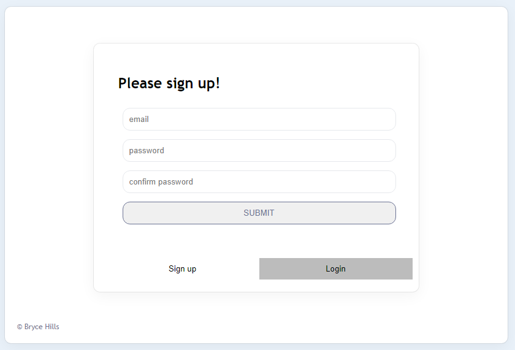
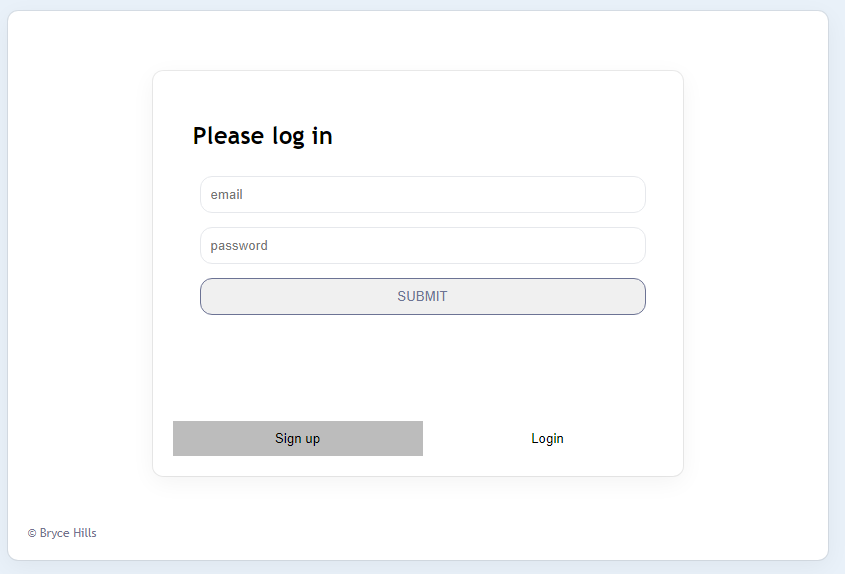

# Todo App

- A simple full-stack app built with React, Node.js, Express.js and Postgres.
- Utilizes PostGres for database & Nodejs for the backend
- Utilizes React for frontend - Styling with standard CSS

## Description

- Allows users to sign up/login to the system and create their own checkist.
    - Users can add/edit/delete tasks
    - Users can edit the name of the task
    - The date is created and savde on each task
    - each task has its own progress bar which displays the percentage completion of each task

- The backend manages saving user email/passwords with 'bcrypt' to hash the password safely
- Frontend utilizes cookies to save each users password and email for ease of use

## Getting Started

### Dependencies

* full list of dependencies can be found in the package.json files
* Languages/platforms: nodejs, react, SQL
* For client, our depencies are:
```
    "react": "^18.2.0",
    "react-cookie": "^4.1.1",
    "react-dom": "^18.2.0",
    "react-scripts": "5.0.1",
    "dotenv": "^16.0.3"
```
* For server, our depencies are:
```
    "pg": "^8.8.0",
    "bcrypt": "^5.1.0",
    "cors": "^2.8.5",
    "express": "^4.18.2",
    "jsonwebtoken": "^8.5.1",
    "nodemon": "^2.0.20",
    "dotenv": "^16.0.3"
```

### ScreenShots
  
  
  


## Authors

Bryce Hills  


## Acknowledgments

* Thanks to @AniaKubow for the project Idea and tutorial!

